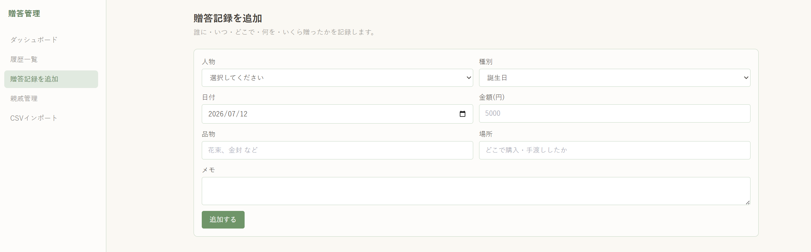
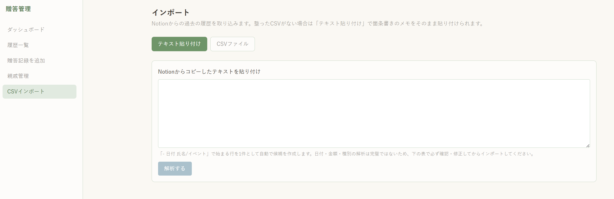

# life-event

親戚の冠婚葬祭・誕生日・お歳暮などで「誰に・いつ・どこで・何を・いくら」贈ったかを記録し、次に控えている人生イベント(誕生日、入学式・卒業式、長寿祝いなど)を把握するためのローカルWebアプリです。

## 使い方

```bash
npm install
npm run dev
```

ブラウザで http://localhost:3000 を開きます。

## データについて

親戚の氏名・誕生日・贈答記録はすべて `data/people.json` と `data/gifts.json` にローカル保存されます。これらのファイルは個人情報を含むため `.gitignore` により **Gitの管理対象外** です。バックアップが必要な場合は `data/` フォルダを手動でコピーしてください。

## 画面

- `/` ダッシュボード: 次に控えている誕生日・入学式/卒業式・長寿祝いを一覧表示
- `/history` 履歴一覧: 贈答記録を日付順に表示・絞り込み
- `/gifts/new` 贈答記録の追加
- `/people` 親戚の登録・編集
- `/import` Notionからの過去の履歴の取り込み(テキスト貼り付け / CSVファイル)

## スクリーンショット

### 贈答記録を追加


### インポート(テキスト貼り付け)

